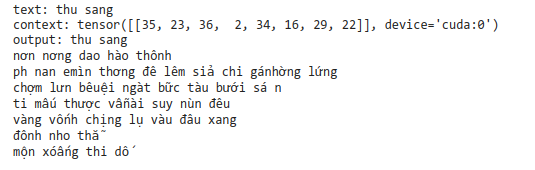
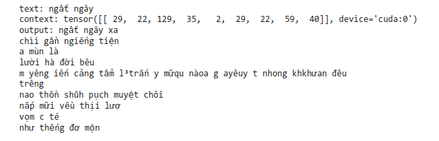
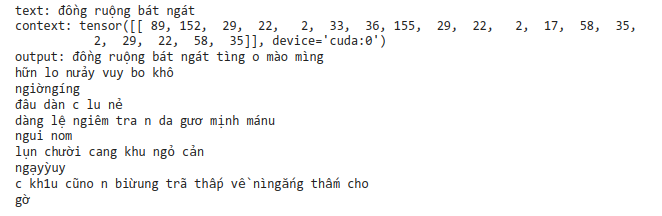
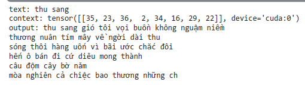
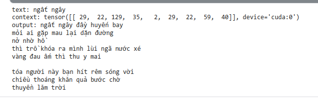
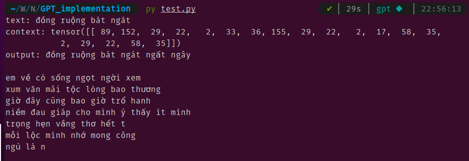

# GPT_implementation

Here is pytorch implementation of a decoder-only model for poem generation. It was trained on [truongpdd/vietnamese_poetry](https://huggingface.co/datasets/truongpdd/vietnamese_poetry) - a dataset of Vietnamese poem. This repo may be useful to understand the architecture of decoder block in transfomer and how a decoder-only model work.

## Result
This still a very simple network and train in just about 20000 iterations with Kaggle GPU P100 and it tooks about 30 mins to train. Therefore, the results are not good but you can still see the improvement in performance after some iterations.

### After 100 iterations
<p align="center">
  <br/>
  <i>Figure_1</i>
</p>
<p align="center">
  <br/>
  <i>Figure_2</i>
</p>
<p align="center">
  <br/>
  <i>Figure_3</i>
</p>

### After 20000 iterations
<p align="center">
  <br/>
  <i>Figure_4</i>
</p>
<p align="center">
  <br/>
  <i>Figure_5</i>
</p>
<p align="center">
  <br/>
  <i>Figure_6</i>
</p>

with the same input, we can see the difference between the output of model after 100 and after 200 iterations.

## How to use
Run the following command to install modules needed 
```bash
pip install -r requirements.txt
```
The code was organized: 
* *In the notebook directory, you can use* **gpt-pytorch-implementation.ipynb** *and adjust some things accordingly your conditions to train on notebook or Kaggle.*
* *set up paramter for dataset and model:* **config.py**
* *download data from hugging face, get batched data:* **data.py**
* *modules needed to build model:* **modules.py**
* *script to train model:* **train.py**
* *test model with different input:* **test.py**
